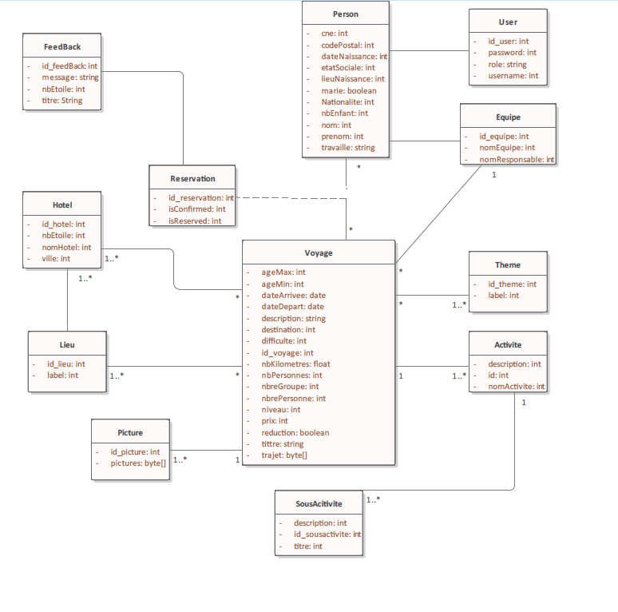
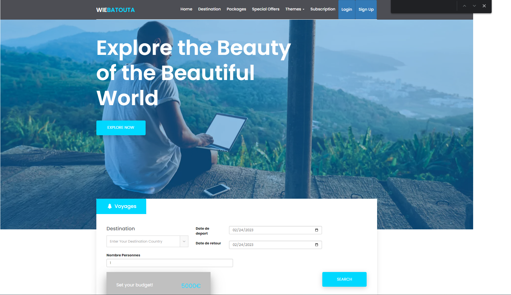
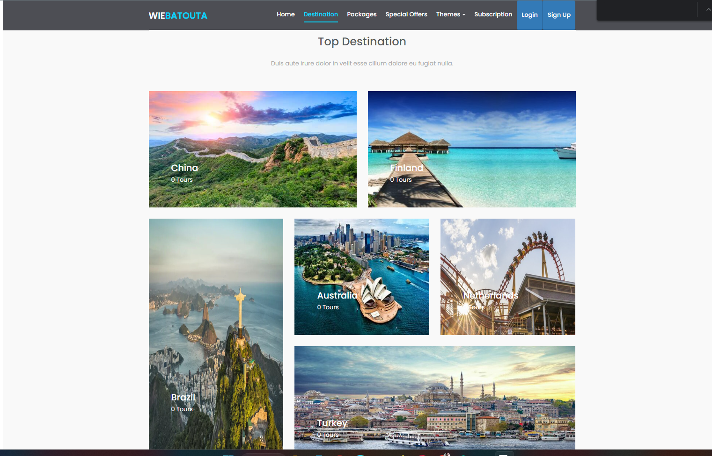

# Travel and Hotel Reservation Platform
For my 5th semester in Morocco, our professor has assigned a project to us that resembles Booking.com. We are expected to develop a platform that facilitates decision-making for travel and hotel reservations. This will involve implementing features such as travel itineraries, hotel room booking, and reservation management. The aim of this project is to apply our theoretical knowledge in a practical setting and develop skills in project management, software engineering, and problem-solving. Throughout the project, we will be required to conduct market research, develop user interfaces, and perform testing and quality assurance. We look forward to the opportunity to work on this challenging project and gain valuable skills and experience in the process.
# Functionalities
## User side
#### Functional Features
##### Search for a Travel 
The platform will allow users to easily search for travel destinations based on their preferences.
##### Like and Give Comments for a Travel
Users will be able to express their appreciation for a travel by liking and leaving comments.
##### Pay for a Travel
The platform will support secure payment methods to ensure hassle-free travel bookings.

##### Propose Hotel for Travel
Users will be able to propose a hotel for a travel destination, thus allowing for more options.

##### Adventure Travel Teams
For adventure travels, the platform will propose adventure teams such as Amazon Team and Afrika Travels to enhance the user's experience.

##### Discounts and Black Fridays
The platform will showcase discounts and Black Friday deals to users, thus allowing them to save on travel expenses.

##### User Authentication and Sign-up with Mail Verification
Users will have the ability to sign-up and authenticate their accounts, with mail verification for added security.

##### Search and Filter for a Travel
Users will be able to filter travel destinations by theme (jungle, beach, etc.), destination, and price.

##### Feedback and Contact Forms
Users will be able to provide feedback on the platform and the travel experience, as well as contact the website for support.

##### Discount Emails
Users will receive emails for discounts and special deals.

## Administrator side
#### Functional Features
##### CRUD operations for travel destinations
The administrator should be able to create, read, update, and delete travel destinations. This includes adding new destinations, updating information about existing ones, and removing destinations that are no longer offered.
##### CRUD operations for teams and travel teams 
The administrator should be able to manage teams and travel teams, which are groups of people who will be traveling together. This includes creating new teams, updating information about existing ones, and removing teams that are no longer needed.
##### Travel creation and activity association
The administrator should be able to create new travels and associate them with activities. This includes selecting a destination, determining the duration and cost of the travel, and specifying which activities will be included.
##### Dashboard and server statistics
The administrator should have access to a dashboard that displays statistics about the server, such as the number of users, the amount of data stored, and the amount of traffic. This information can help the administrator monitor the health of the system and identify areas for improvement.
##### Travel feedback and ratings
The administrator should be able to view feedback and ratings for each travel. This includes the number of likes and dislikes for each travel, as well as comments and reviews left by users.
##### Action history
The administrator should be able to view a history of their actions within the system. This includes a log of all changes made to travel destinations, teams, and other elements of the system.
# Technologies
- Spring boot 2:
    - Spring batch
    - Spring Web
    - Spring Data
    - Spring mail ( SMTP Support )
    - Spring validator
    - Spring security
    - Spring o2Auth
- JSON Support (Gson, fasterxml.jackson)
- REST API support
- HTML5/CSS3 / Java Script (JQuery)
- Maven
- MySQL 5
- HTTPS Security
- Maven

# Server conception

# Website design



# Website reports
[Download Powerpoint Presentation](reports/PresentationAgenceVoyage.pptx)
[Download Word Report](reports/Rapport.docx)
[Download PDF Report](reports/Rapport.pdf)
# Requirement
- JDK 16 : https://www.oracle.com/java/technologies/javase/jdk16-archive-downloads.html
- Maven : https://maven.apache.org/download.cgi
- Docker

##### Test requirements
#
```sh
java -version # 16.0.2
mvn # Should show error, this is normal
```
# Configuration
Edit please the database username and password at src/main/resources/applications.properties
This application use mailing service for email verification, so please configure an SMTP Server for example (Yahoo.com, google.com), and paste the creds in the file **src.main.resources.applications.properties**.

# Installing
```sh
# For easy running and avoiding dependencies and sql versions problem, please use docker and following image building
cd TravelAgency
docker compose up --build
```

# About us
For any questions contact me : ziadbougrine@gmail.com
Or on my social media in the github profile.